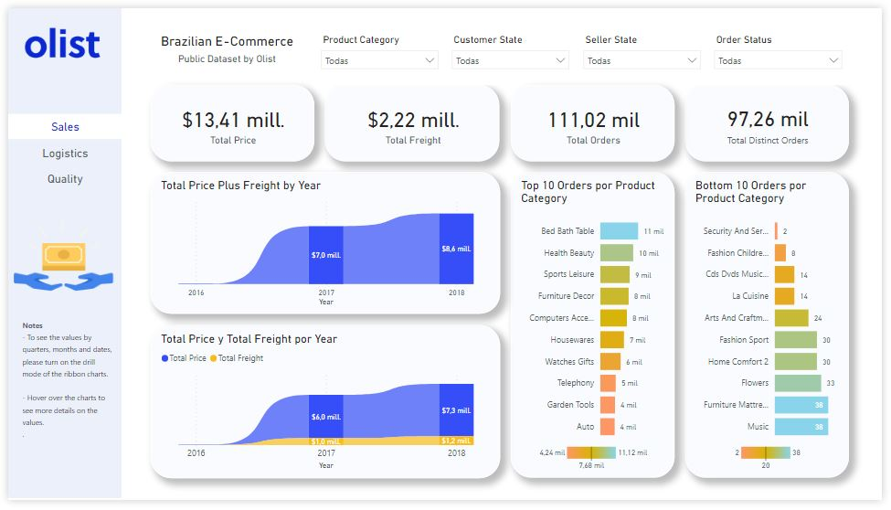
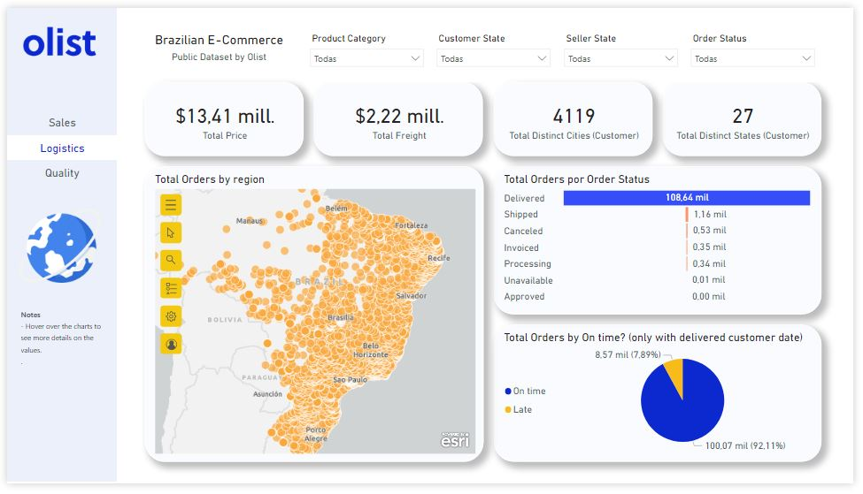
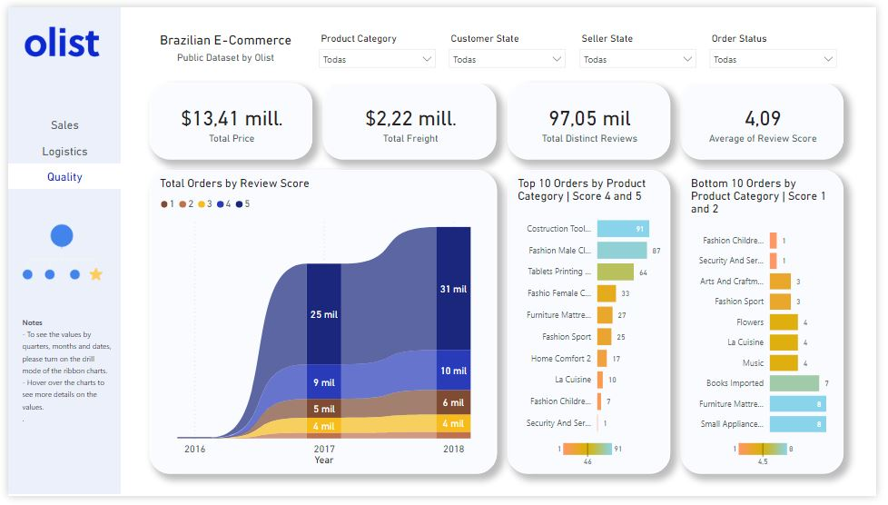

# Olist Brazilian E-Commerce Dashboard
Dashboard realizado con el dataset público de las órdenes realizadas en la plataforma de Olist. El conjunto de datos se compone de 100 K órdenes comprendidas entre el año 2016 y 2018 realizados en múltiples marketplaces en Brasil.

## Contexto

Olist es una empresa de tecnología que facilita a cualquier persona que quiera vender en los principales marketplaces de Brasil a través de una plataforma que permite la publicación, generación de órdenes y gestión de enviós en un solo lugar. Para mas información puede visitar ww.olist.com.

## Notas

1. Los datos se encuentran en inglés.
2. Todo el texto que identifica tiendas y socios fue reemplazado por los nombres de las grandes casas de Game of Thrones.

## Acerca del conjunto de datos

El conjunto de datos principal es una versión de Kaggle [Brazilian E-Commerce Public Dataset by Olist](https://www.kaggle.com/datasets/olistbr/brazilian-ecommerce). 
Las características de estos datos permiten visualizar un pedido desde múltiples dimensiones:

* Order status.
* Price.
* Payment.
* Freight Performance.
* Product attributes.
* Reviews written by customers.
* Zip codes with lat/lon

## Aspectos de evaluación

Se abarcó  tres aspectos clave del negocio de Olist como las Ventas, Logistica y Calidad.

Siéntete libre de descargar el archivo .pbix para interactuar con los paneles para una mejor comprensión y experiencia.

## Ventas

 

## Logística

 

## Calidad de entregas

 

## Documentación

* [Documentación de ArcGIS](https://doc.arcgis.com/es/)

## Contact

Jorge Galicia Torres : jgaliciator@gmail.com

LinkedIn: https://www.linkedin.com/in/jorge-galicia-torres/  
