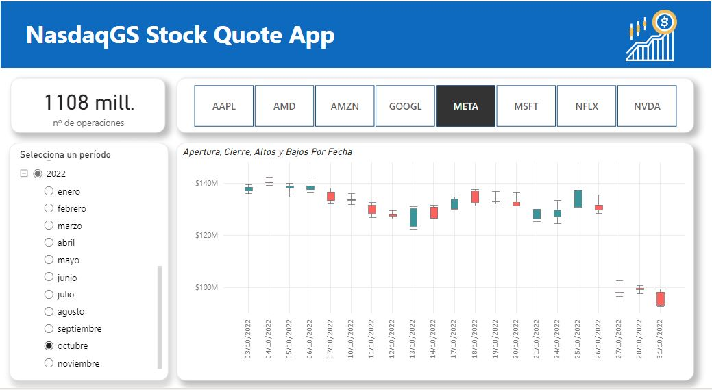

# Dashboard dinámico de cotizaciones de bolsa de NasdaqGS 
En este proyecto se realizó la tarea de extraer datos de Yahoo Finance sobre las cotizaciones de bolsa diarias de 8 empresas de tecnología pertenecientes a NasdaqGS. La informacíón es ingestada dinámicamente y solo requiere actualizarse para traer nuevos datos.

## Contexto

Olist es una empresa de tecnología que facilita a cualquier persona que quiera vender en los principales marketplaces de Brasil a través de una plataforma que permite la publicación, generación de órdenes y gestión de enviós en un solo lugar. Para mas información puede visitar ww.olist.com.

Después de que un cliente compra el producto de Olist Store, se notifica a un vendedor para cumplir con ese pedido. Una vez que el cliente recibe el producto, o vence la fecha estimada de entrega, el cliente recibe una encuesta de satisfacción por correo electrónico donde puede dejar una nota sobre la experiencia de compra y anotar algunos comentarios.

## Acerca del conjunto de datos

El conjunto de datos principal es una versión de Kaggle [Brazilian E-Commerce Public Dataset by Olist](https://www.kaggle.com/datasets/olistbr/brazilian-ecommerce). 
Las características de estos datos permiten visualizar un pedido desde múltiples dimensiones.

## Aspectos de evaluación

Con estos datos se analizará aspectos clave del negocio como las Ventas, Logistica y Calidad.

Siéntete libre de descargar el archivo .pbix para interactuar con los paneles para una mejor comprensión y experiencia.

## Dashboard

Recall of the Confusion Matrix will be used as a method for evaluating model performance. Our main interest is to find those shipments that will not arrive on time. **The recall will answer the question: 
What percentage of shipments that do not arrive on time are we able to identify?**

 

## Documentación

* [Documentación de ArcGIS](https://doc.arcgis.com/es/)

## Contacto

Jorge Galicia Torres : jgaliciator@gmail.com

LinkedIn: https://www.linkedin.com/in//
