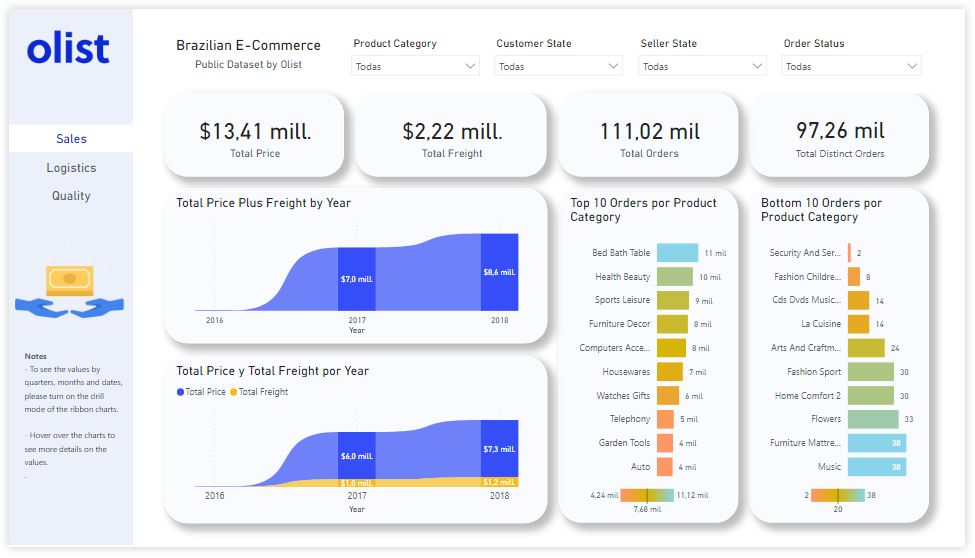

# Olist-Brazilian-E-Commerce-Analysis
Dashboard realizado con el dataset público de las órdenes realizadas en Olist. El conjunto de datos se compone de 100 k órdenes comprendidos entre el 2016 y el 2018 realizados en múltiples marketplaces en Brasil.

## Contexto

Olist es una empresa de tecnología que facilita a cualquier persona que quiera vender en los principales marketplaces de Brasil a través de una plataforma que permite la publicación, generación de órdenes y gestión de enviós en un solo lugar. Para mas información puede visitar ww.olist.com.

Después de que un cliente compra el producto de Olist Store, se notifica a un vendedor para cumplir con ese pedido. Una vez que el cliente recibe el producto, o vence la fecha estimada de entrega, el cliente recibe una encuesta de satisfacción por correo electrónico donde puede dejar una nota sobre la experiencia de compra y anotar algunos comentarios.

Con estos datos se analizará aspectos clave del negocio como las Ventas, Logistica y Calidad.

## Notas

1. Los datos se encuentran en inglés.
2. Todo el texto que identifica tiendas y socios fue reemplazado por los nombres de las grandes casas de Game of Thrones.

## Acerca del conjunto de datos

El conjunto de datos principal es una versión de Kaggle [Brazilian E-Commerce Public Dataset by Olist](https://www.kaggle.com/datasets/olistbr/brazilian-ecommerce). 
Las características de estos datos permiten visualizar un pedido desde múltiples dimensiones.

* Estado de orden (order status)
* Precio (Price).
* Pago (Payment)
* (Freight Performance)
* Atributos de producto (Product attributes)
* Reviews written by customers
* Códigos postales brasileños con coordenadas de longitud y latitud.

## Aspectos de evaluación

## Ventas

Recall of the Confusion Matrix will be used as a method for evaluating model performance. Our main interest is to find those shipments that will not arrive on time. **The recall will answer the question: 
What percentage of shipments that do not arrive on time are we able to identify?**

 

## Logística

Accuracy is a metric also based on the confusion matrix. In this case we will take this metric to evaluate the classification performance for both class 1 and class
0 in our target variable. Note that in this exercise the primary class will be class 1, i.e. those shipments that do not arrive on time.

 

## General Steps

1. Exploratory Data Analysis (EDA)
2. Data Preprocessing
3. First Modeling Batch (Working with raw data)
4. Second Modeling Batch (Aplying One hot Encoding)
5. Third Modeling Batch (Evaluating StandardScaler)
6. Fourth Modeling Batch (Evaluating Dimension Reduction using PCA)
7. Final model selection and searching for best hyperparameters with GridSearchCV
8. Conclusions

For more deep information please don't hesitate to open the main.ipynb.

 

## Documentation

* [Sckit-Learn Documentation](https://scikit-learn.org/stable/index.html#)
* [StandardScaler vs MinMaxScaler](https://stackoverflow.com/questions/61255108/python-numpy-ravel-function-not-flattening-array)
* [Video: Scaling, Normalization and Standardization (Spanish)](https://www.youtube.com/watch?v=-VuR14Qyl7E&lc=UgyGv3R3K4siP3YPgLh4AaABAg.9gDcR4wNAti9gDnlbOEOx4)
* [Video: How to implement One Hot Encoding](https://www.youtube.com/watch?v=InZ0n2knz1E&lc=UgymfF3vTXC8PFTFOZR4AaABAg.9gAv8UJZvWe9gBrEABT8oV)

## Contact

Jorge Galicia Torres : jgaliciator@gmail.com

LinkedIn: https://www.linkedin.com/in/jeanfabra/
